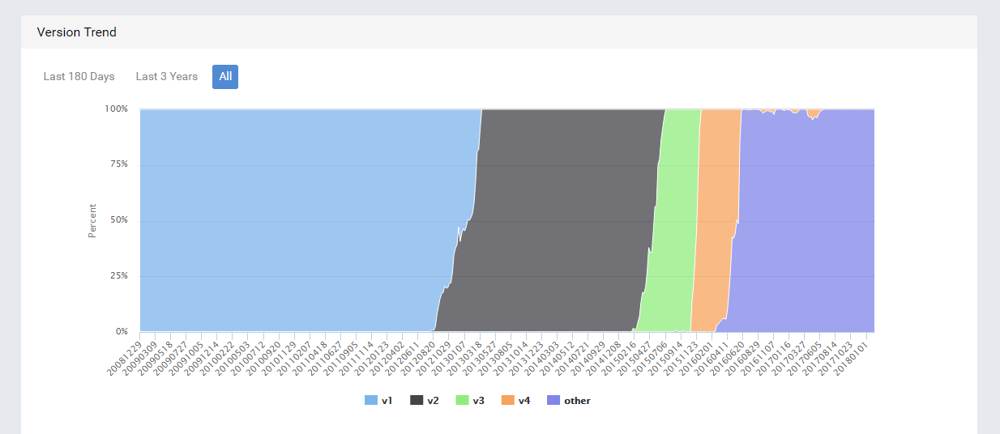
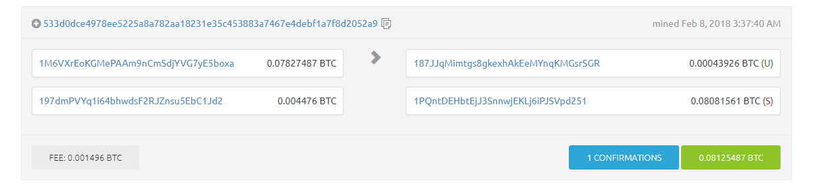

# Bitcoin

|Resources|
|---|
|[paper](https://bitcoin.org/bitcoin.pdf)|
|[bitcoin Stack exchange](https://bitcoin.stackexchange.com)|
|[blockexplorer](https://blockchain.info/)|
|[private testnet](https://github.com/freewil/bitcoin-testnet-box)|
|[bitcoind](https://en.bitcoin.it/wiki/Bitcoind)|
|[developer doc](https://bitcoin.org/en/developer-documentation)|

# Table of contents
1. [Objective](#Objective)
2. [Glossary](#Glossary)
   1. [Bitcoin](#btc)
   2. [Block](#block)
   3. [Merkle Tree](#merkletree)
   4. [Proof of Work](#pow)
   5. [Target](#target)
3. [Mathematical Functions Used](#Mathematical-Functions-Used)
4. [References](#references)

<a name="Objective"></a>
## Objective : 
*visualizing bitcoin blockchain and discussing how exactly bitcoin uses blockchain*

<a name="Glossary"></a>
## Glossary : 

<a name="btc"></a>
### Bitcoin : 
Bitcoin is a digital currency (also called crypto-currency).

According to Wikipedia: 

>>Bitcoin is a cryptocurrency and worldwide payment system.[9]:3 It is the first decentralized digital currency, as the system works >>without a central bank or single administrator.[9]:1[10] The network is peer-to-peer and transactions take place between users >>directly, without an intermediary.[9]:4 These transactions are verified by network nodes through the use of cryptography and recorded >>in a public distributed ledger called a blockchain

#### Bitcoin Transactions:
Bitcoin transactions are made by digitally ~~exchanging~~ ~~anonymous~~, heavily ~~encrypted~~ hash codes across a peer-to-peer (P2P) network. The P2P network monitors and verifies the transfer of Bitcoins between users. ~~~Each user's Bitcoins are stored in a program called a digital wallet~~, which also holds each address the user sends and receives Bitcoins from, as well as a private key known only to the user. 

<a name="block"></a>
### Block   
Blocks are files where transactions are permanently recorded. A block records some or all of the most recent Bitcoin transactions that have not yet entered any prior blocks. Thus a block is like a page of a ledger or record book. Each time a block is ‘completed’, it gives way to the next block in the blockchain. A block is thus a permanent store of records which, once written, cannot be altered or removed. 

#### Contents of a Block 
##### Block # : 
It is a number which behaves like a counter. Every new block mined is given a Block # which is one greater than its previous block. The Block # starts from 0.Also called depth of a block in the Bitcoin Blockchain.
Count of current number of blocks can be seen [here](https://blockexplorer.com/api/status?q=getBlockCount "Count of blocks").

##### Block Structure :
| Field               | Description                                  | Size                                    |
| --------------------|:--------------------------------------------:| ---------------------------------------:|
| Magic no	          | value always 0xD9B4BEF9                      |	4 bytes                                |
| Blocksize	          | number of bytes following up to end of block |	4 bytes                                |
| Blockheader         |	consists of 6 items                          |	80 bytes                               |
| Transaction counter |	positive integer VI = VarInt                 |	1 - 9 bytes                            |
| Transactions        |	the (non empty) list of transactions         |	many transactions                      |

##### Number of Transactions: 
The absolute limit is the size of the block, which is currently hard-coded at 1,000,000 bytes. Each transaction takes up a variable amount of space, but ~250 bytes is about right for a simple transaction.

However as soon as a block is mined it is not possible to extend the block by adding in more transactions, as the proof of work has to be redone, so broadcasting it immediately is the only sensible thing to do. So the number of transactions in a block is actually a function of the number of transactions being generated over a time period and the time taken to solve a given block.

##### Height:
The number of blocks preceding a particular block on a block chain. For example, the genesis block has a height of zero because zero block preceded it.

##### Block Reward:
Every block also contains a record of which Bitcoin addresses or scripts are entitled to receive the reward. This record is known as a generation transaction, or a coinbase transaction, and is always the first transaction appearing in every block. The number of Bitcoins generated per block starts at 50 and is halved every 210,000 blocks.
Bitcoin transactions are broadcast to the network by the sender, and all peers trying to solve blocks collect the transaction records and add them to the block they are working to solve. Miners get incentive to include transactions in their blocks because of attached transaction fees.

##### Timestamp:
A node adds a timestamp as soon as it detects a new block in the network. So, it can be said that the timestamp is a rough indicator of when the block was formed by the miner.
It is possible that the timestamp of a newer block is older that the timestamp of the older block.

From bitcoin.it/wiki/Block_timestamp:

>A timestamp is accepted as valid if it is greater than the median timestamp of previous 11 blocks, and less than the network-adjusted >time + 2 hours.

##### Mined by:
Name of the miner or the mining pool which mined the block. Blocks do not need to contain any identifying factors. The miner can choose to provide a script in the coinbase of a new block that can be used to identify the source of the block, however they are not required to do so. Hence, some blocks have empty 'Mined By' field.

##### Merkle Root:
It is the hash of the root node of the particular block's Merkle Tree. For more information see [Merkle Tree](#merkletree).

##### Previous Block:
The block preceeding the current block is known as the previous block. Each block is guaranteed to come after the previous block chronologically because the previous block's hash would otherwise not be known. Because a block can only reference one previous block, it is impossible for two forked chains to merge.

##### Difficulty:
The difficulty of the mathematical problem is automatically adjusted by the network, such that it targets a goal of solving an average of 6 blocks per hour. Every 2016 blocks (solved in about two weeks), all Bitcoin clients compare the actual number created with this goal and modify the target by the percentage that it varied. The network comes to a consensus and automatically increases (or decreases) the difficulty of generating blocks.

##### Bits:

##### Size(bytes):
~~Currently size of bitcoin is 1 MB ~~, this is what founder of bitcoins secretly commited. Although many attempts were made to increase the size of blocks to 7MB,10MB etc to increase the speed of transraction.
Many 'Altcoins' have also been created by forking bitcoin and increasing size block's size and other minor changes. 


##### Version:
The version number is a parameter to help in updating how blocks are treated by the network. As newer rules and regulations concerning blocks come into play, the block version gets updated.



##### Nonce:
The "nonce" in a bitcoin block is a 32-bit (4-byte) field whose value is set so that the hash of the block will contain a run of leading zeros. The rest of the fields may not be changed, as they have a defined meaning .Any change to the block data (such as the nonce) will make the block hash completely different. Since it is infeasible to predict which combination of bits will result in the right hash, many different nonce values are tried, and the hash is recomputed for each value until a hash containing the required number of zero bits is found just like Brute Force technique.

##### Transactions:
A transaction is a transfer of Bitcoin value that is broadcast to the network and collected into blocks. Transactions are not encrypted, so it is possible to browse and view every transaction ever collected into a block. Once transactions are buried under enough confirmations they can be considered irreversible.



#### Genesis Block   
A genesis block is the first block of a block chain. Modern versions of Bitcoin number it as block 0, though very early versions counted it as block 1. The genesis block is almost always hardcoded into the software of the applications that utilize its block chain. It is a special case in that it does not reference a previous block, and for Bitcoin and almost all of its derivatives, it produces an unspendable subsidy.


<a name="merkletree"></a>
### Merkle Tree    
Merkle Tree is a tree in which every leaf node contains the hash of a data block and every non leaf node contains
a hash value which has been formed by combining the hashes of its children nodes.Typically, Merkle trees have a                 branching factor of 2, meaning that each node has up to 2 children.The root of the tree is called Merkle Root.
The leaf nodes are transactions within a block.
              
#### Need
In various distributed and peer-to-peer systems, data verification is very important. This is because the same                 data exists in multiple locations. So, if a piece of data is changed in one location, it's important that data is               changed everywhere. Data verification is used to make sure data is the same everywhere.

However, it is time consuming and computationally expensive to check the entirety of each file whenever a system               wants to verify data. So, this why Merkle trees are used. Basically, we want to limit the amount of data being                 sent over a network (like the Internet) as much as possible. So, instead of sending an entire file over the                     network, we just send a hash of the file to see if it matches.
              
#### Utility
The utility of Merkle trees are as follows:

1. Merkle Trees are tamper proof. Even if a single bit is changed in any of the leaf nodes or any non
   leaf node, the hash of its parent changes significantly proving that tampering had taken place.

2. If we want to validate a leaf node, we only need to consider one branch of the Merkle Root, the                                other can be ignored as it is not of any use here.
              
#### Use 
Currently, their main uses are in peer-to-peer networks such as Tor, Bitcoin, and Git.

#### PseudoCode
```
d1 = dhash(a)
d2 = dhash(b)
d3 = dhash(c)
d4 = dhash(c)            // a, b, c are 3. that's an odd number, so we take the c twice

d5 = dhash(d1 concat d2)
d6 = dhash(d3 concat d4)

d7 = dhash(d5 concat d6)
```
where
```
dhash(a) = sha256(sha256(a))
```
Note: markle tress generally uses sha256 for hashes and also RIPEMD-160 for smaller desired address like bitcoin address.

#### Complexity


<a name="pow"></a>
### Proof of Work:   
A proof of work is a piece of data which is difficult (costly, time-consuming) to produce but easy for others to verify and which satisfies certain requirements. Producing a proof of work can be a random process with low probability so that a lot of trial and error is required on average before a valid proof of work is generated.

Hashcash proofs of work are used in Bitcoin for block generation. In order for a block to be accepted by network participants, miners must complete a proof of work which covers all of the data in the block. The difficulty of this work is adjusted so as to limit the rate at which new blocks can be generated by the network to one every 10 minutes. Due to the very low probability of successful generation, this makes it unpredictable which worker computer in the network will be able to generate the next block.

<a name="target"></a>
### Target:    
The target is a 256-bit number that all Bitcoin clients share. The SHA-256 hash of a block's header must be lower than or equal to the current target for the block to be accepted by the network. The lower the target, the more difficult it is to generate a block.

For reasons of stability and low latency in transactions, the network tries to produce one block every 10 minutes. Every 2016 blocks (which should take two weeks if this goal is kept perfectly), every Bitcoin client compares the actual time it took to generate these blocks with the two week goal and modifies the target by the percentage difference. This makes the proof-of-work problem more or less difficult. A single retarget never changes the target by more than a factor of 4 either way to prevent large changes in difficulty.

<a name="Mathematical-Functions-Used"></a>
### Mathematical Functions Used:

[Elliptic Curve Digital Signal Algorithm](https://en.wikipedia.org/wiki/Elliptic_Curve_Digital_Signature_Algorithm)
[Mathematical Trap Door](https://en.wikipedia.org/wiki/Trapdoor_function)

<a name="references"></a>
## References    

### Video References:
https://www.youtube.com/watch?v=VkWiTvPnTcY

https://www.youtube.com/watch?v=gUwXCt1qkBU

### Documents: 
https://brilliant.org/wiki/merkle-tree/

Block (Bitcoin Block) https://www.investopedia.com/terms/b/block-bitcoin-block.asp

https://bitcoin.org/en/developer-guide

https://coindesk.com

https://tradeblock.com

https://en.bitcoin.it/wiki


